<h1 align="center">Schoolarc</h1>

<h4 align="center">
    App to help students manage their homeworks and exams, simply in one app.
</h4>

<div align="center">
    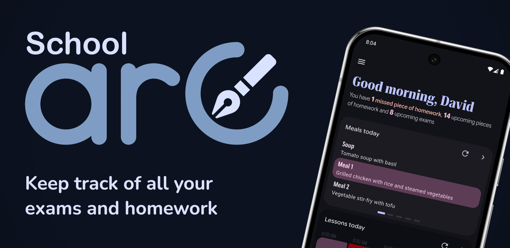
</div>

## Features

- Save homework and exams
    - Priorities (🔴🟠🟢🔵)
    - Assign subjects
- Calendar view
- Save and view timetable
- Bakaláři integration (Czech school system)
    - Import timetable, subjects
    - View current timetable with changes
    - View and import current homeworks
- Strava.cz integration (Czech canteen system)
- Material You theme
- Responsive design
  
## Screenshots

<details open>
    <summary>Dark mode screenshots</summary>
        <div align="center">
            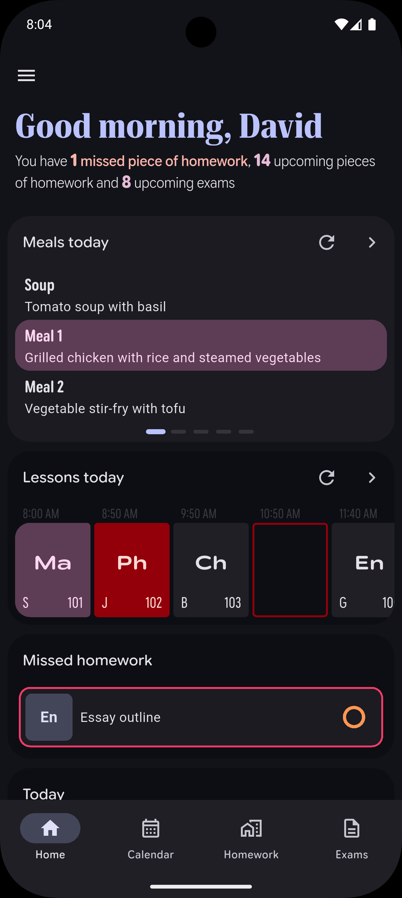
            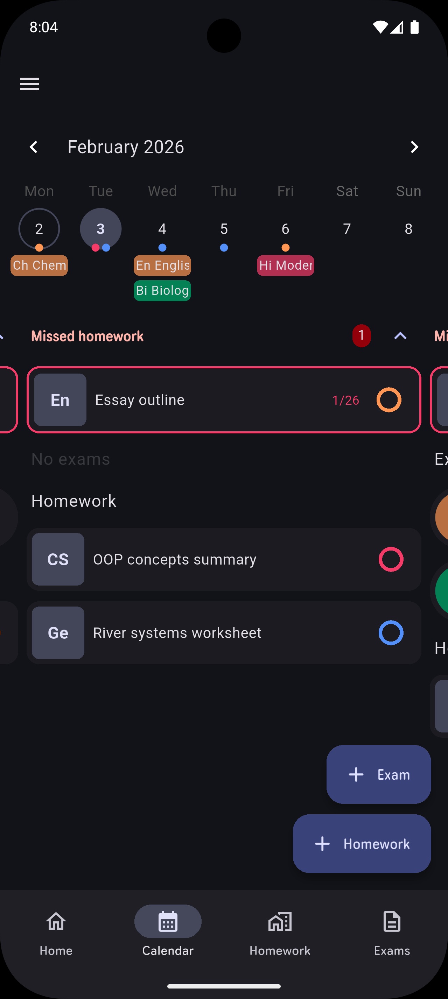
            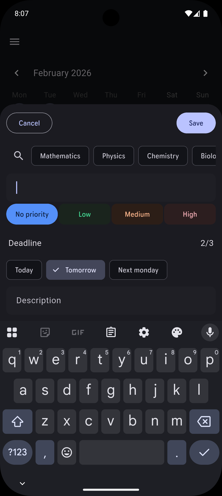
            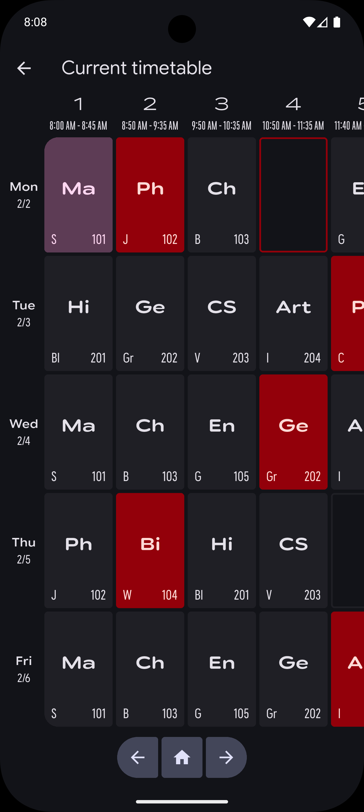
            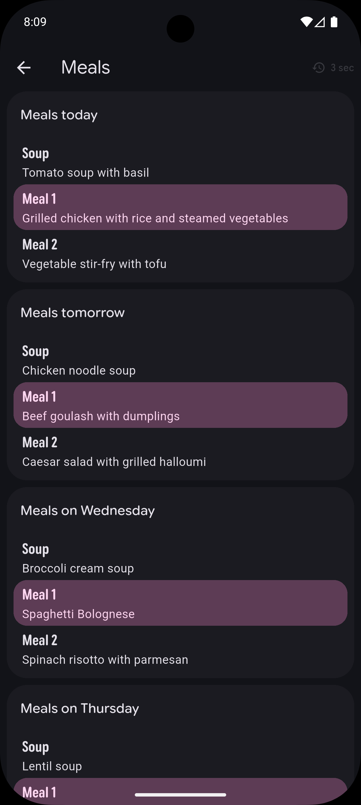
        </div>
</details>

<details>
    <summary>Light mode screenshots</summary>
    <div align="center">
        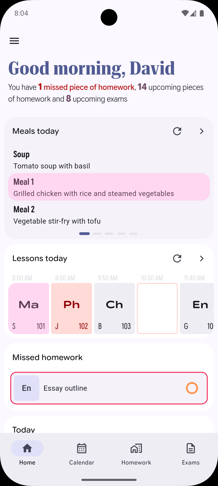
        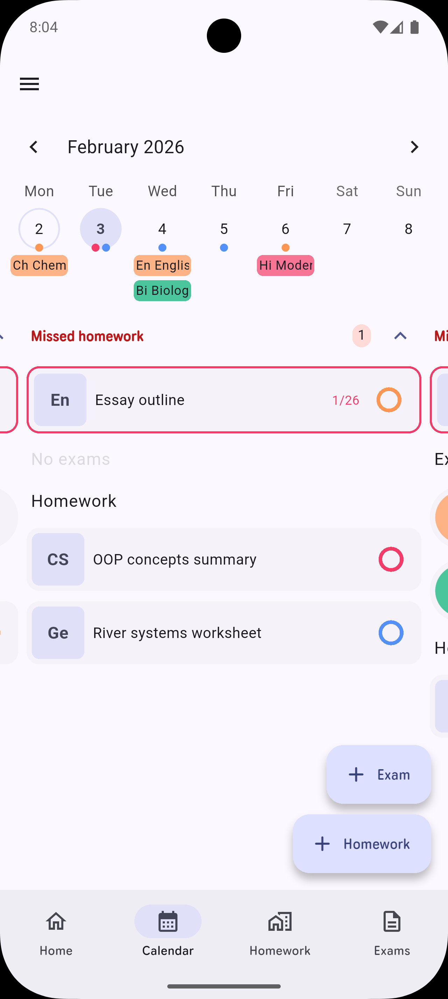
        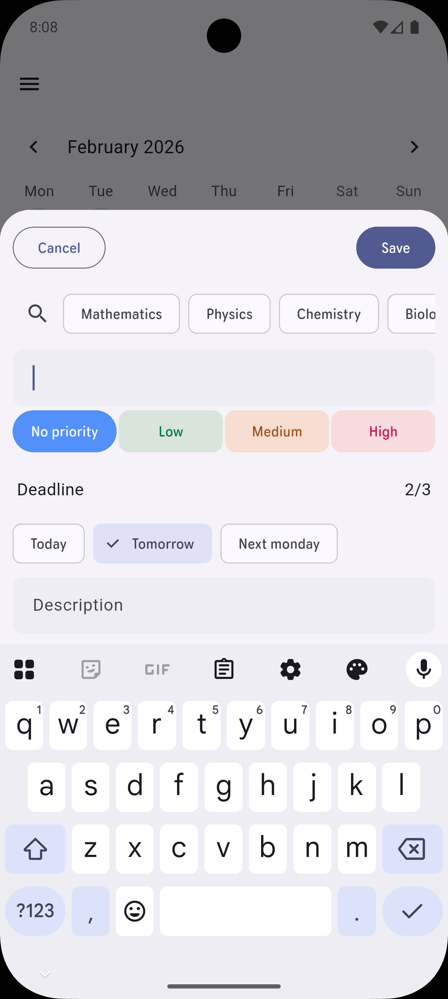
        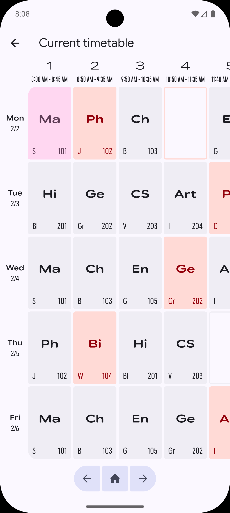
        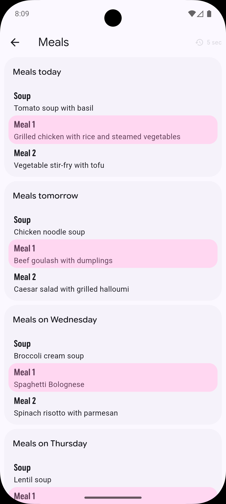
    </div>
</details>

<details>
    <summary>Dark mode desktop screenshots</summary>
    <div align="center">
        
        
        
        
        
    </div>
</details>

<details>
    <summary>Light mode desktop screenshots</summary>
    <div align="center">
        
        
        
        
        
    </div>
</details>

## Platforms
Schoolarc can run on most platforms, however, it is optimized and tested mainly for use on Android and iOS. Some functions don't even work on other operating systems and on web data loss can occur.

|         | Cloud synchronization | Bakaláři | Strava.cz | Notifications | Homescreen Widget |
| ------- | :-------------------: | :------: | :-------: | :-----------: | :---------------: |
| Android |           ✅           |    ✅     |     ✅     |       ✅       |         ✅         |
| iOS     |           ✅           |    ✅     |     ✅     |       ✅       |         ❌         |
| Web     |           ✅           |    ✅     |     ✅     |       ❌       |         ❌         |
| Windows |           ❌           |    ✅     |     ✅     |       ❌       |         ❌         |
| macOS   |           ❔           |    ❔     |     ❔     |       ❔       |         ❔         |
| Linux   |           ❔           |    ❔     |     ❔     |       ❔       |         ❔         |

 ✅ working       ❌ not working     ❔not tested

# How to run locally

Note: This is only for development, you can download and install here. TODO

First, install [flutter sdk](https://docs.flutter.dev/install). Copy the repository and inside the console run
```
flutter pub get 
```
Wait few seconds for all problems to resolve. Select a device with pressing f1 and searching for *Flutter: Select device*. Then you can start debugging with pressing f5.

You can also build with (replace \<target> with desired platform)
```
flutter build <target>
```

For android, i recommend
```
flutter build apk --flavor prod --target-platform=android-arm64
```
as it is compatible with most devices and has the smallest sizes

## Firebase initialization

Configure [flutterfire](https://firebase.flutter.dev/docs/overview), run flutterfire configure and follow the instructions.

<!-- On windows, sometimes the windows is stuck on white or black - 
in that case, you can resize the windows using powertoys zones
 and rerun the project -->

## Testing

Init Firebase emulator with
```
firebase init emulators
```
select a project, tick auth and database and before running, start the emulators with
```
firebase emulators:start --only "auth,database"
```
